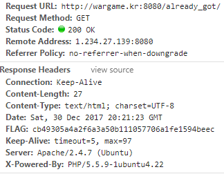

# Wargame.kr [already_get]
* Question

can you see HTTP Response header?

* Script
```
you've already got key! :p
```

1. 크롬혹은파이어폭스를이용하여 HTTP Response header를 보면되는 간단한 문제이다

2. 


3. Flag:cb49305a4a2f6a3a50b111057706a1fe1594beec
